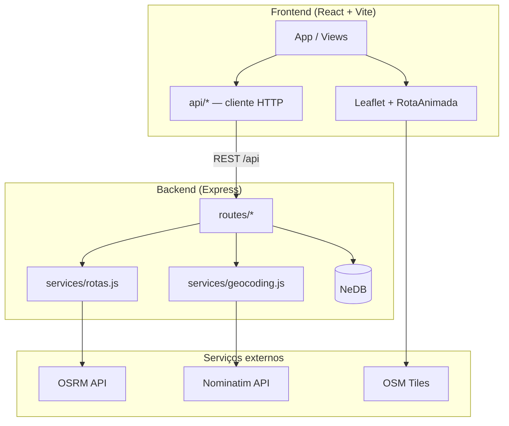
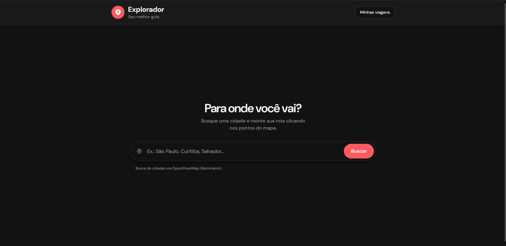
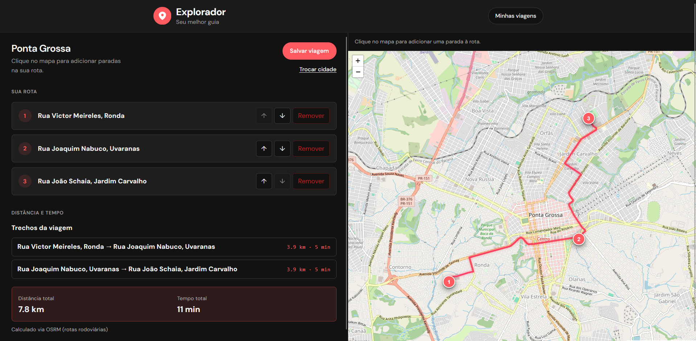
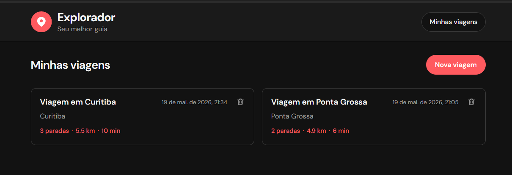

# Explorador

**Seu melhor guia para planejar rotas de viagens!**

Aplicação full stack para montar itinerários com várias paradas: busque uma cidade, marque pontos no mapa, reorganize a ordem, veja distância e tempo de cada trecho e salve viagens para consultar ou editar depois.

Desenvolvido como solução do desafio da **MM Tech** (Node + React + NeDB).

**Repositório:** [github.com/voronll/explorador](https://github.com/voronll/explorador)

---

## Índice

- [Funcionalidades](#funcionalidades)
- [Requisitos do desafio](#requisitos-do-desafio)
- [Demonstração do fluxo](#demonstração-do-fluxo)
- [Stack tecnológica](#stack-tecnológica)
- [Arquitetura](#arquitetura)
- [Estrutura do projeto](#estrutura-do-projeto)
- [Pré-requisitos](#pré-requisitos)
- [Como rodar localmente](#como-rodar-localmente)
- [Variáveis de ambiente](#variáveis-de-ambiente)
- [API REST](#api-rest)
- [Modelo de dados](#modelo-de-dados)
- [Decisões técnicas](#decisões-técnicas)
- [APIs externas](#apis-externas)
- [Scripts](#scripts)
- [Limitações conhecidas](#limitações-conhecidas)
- [Capturas de tela](#capturas-de-tela)
- [Licença](#licença)

---

## Funcionalidades

| Área | O que o usuário pode fazer |
|------|----------------------------|
| **Busca** | Encontrar cidades no Brasil com autocomplete (Nominatim / OpenStreetMap) |
| **Planejamento** | Adicionar paradas clicando no mapa; lista numerada com subir, descer e remover |
| **Rota** | Visualizar trajeto pelas ruas (OSRM), com animação de desenho e “marcha” no mapa |
| **Métricas** | Ver distância e tempo por trecho e totais da viagem |
| **Viagens** | Salvar, listar, abrir detalhe, **editar** paradas e rota, excluir com confirmação |
| **UX** | Layout split (lista + mapa), tema claro/escuro, responsivo, feedback de carregamento |

### Modos da interface

```
┌─────────────┐     busca cidade      ┌──────────────────┐
│    Home     │ ───────────────────►  │   Planejamento   │
│ (BarraBusca)│                       │ lista │ mapa     │
└─────────────┘                       └────────┬─────────┘
       ▲                                       │ Salvar viagem
       │ Nova viagem                           ▼
       │                              ┌──────────────────┐
       │         Minhas viagens       │  Detalhe viagem  │
       └──────────────────────────────│  (leitura/edição)│
                                      └──────────────────┘
```

---

## Requisitos do desafio

| Requisito | Implementação |
|-----------|----------------|
| Adicionar destinos (formulário, mapa ou outro) | Clique no mapa + reverse geocoding; busca de cidade na barra superior |
| Reorganizar ordem dos destinos | Botões subir/descer na lista (planejamento e edição de viagem salva) |
| Deletar destinos a qualquer momento | Botão **Remover** em cada parada |
| Distância e tempo entre dois destinos (API externa) | OSRM — métricas por `leg` entre paradas consecutivas |
| Distância e tempo total da viagem | Agregação no resumo da rota (`total`) |
| CRUD completo | Destinos (rascunho) + viagens salvas com Create, Read, Update, Delete |
| Node + React + NeDB | Express 5, React 19, NeDB em arquivos `.db` |

---

## Demonstração do fluxo

1. **Início** — Digite o nome de uma cidade (ex.: *Florianópolis*) e selecione uma sugestão.
2. **Planejar** — Clique no mapa para adicionar paradas; use ↑ ↓ para reordenar.
3. **Acompanhar a rota** — A linha é traçada pelas ruas; o resumo mostra cada trecho e o total.
4. **Salvar** — **Salvar viagem** grava cidade, paradas e geometria/métricas no NeDB.
5. **Minhas viagens** — Abra um card, veja o detalhe ou exclua com confirmação.
6. **Editar** — No detalhe, **Editar** → mapa com contorno laranja → altere paradas → **Salvar**.

> **Dica:** ao trocar de cidade ou voltar à home, o **rascunho** de paradas é limpo automaticamente. Viagens já salvas não são afetadas.

---

## Stack tecnológica

| Camada | Tecnologias |
|--------|-------------|
| **Backend** | Node.js, Express 5, NeDB, dotenv, cors |
| **Frontend** | React 19, Vite 8, Leaflet / react-leaflet |
| **Roteamento** | [OSRM](https://project-osrm.org/) (distância, duração, geometria) |
| **Geocoding** | [Nominatim](https://nominatim.org/) (busca de cidades e reverse geocode) |
| **Mapas** | [OpenStreetMap](https://www.openstreetmap.org/) (tiles) |

---

## Arquitetura



### Rascunho vs viagem salva

Dois “mundos” de dados convivem de forma intencional:

| Conceito | Onde fica | Uso |
|----------|-----------|-----|
| **Rascunho** | `destinations.db` | Planejamento ativo: paradas enquanto o usuário monta a rota antes de salvar |
| **Viagem salva** | `viagens.db` | Snapshot imutável até o usuário editar: `cidade`, `destinos`, `resumoRota` |

Ao salvar uma viagem, o backend persiste um snapshot; o rascunho é limpo (`DELETE /api/destinos/rascunho`). Na edição de viagem salva, o frontend mantém estado local e usa `POST /api/rota/preview` para recalcular a rota sem gravar no rascunho.

---

## Estrutura do projeto

```
explorador/
├── docs/
│   └── screenshots/             # Capturas para o README
├── backend/
│   ├── data/                    # Arquivos NeDB (gerados em runtime)
│   │   ├── destinations.db      # Rascunho de paradas
│   │   └── viagens.db           # Viagens salvas
│   ├── src/
│   │   ├── server.js            # Entrada Express
│   │   ├── db.js                # Configuração NeDB
│   │   ├── polyfill-node.js     # Compatibilidade NeDB + Node 22+
│   │   ├── routes/
│   │   │   ├── destinos.js      # CRUD rascunho + reordenar
│   │   │   ├── rota.js          # Resumo OSRM + preview
│   │   │   ├── geocoding.js     # Proxy Nominatim
│   │   │   └── viagens.js       # CRUD viagens
│   │   └── services/
│   │       ├── rotas.js         # Integração OSRM
│   │       └── geocoding.js     # Rate limit + normalização
│   ├── .env.example
│   └── package.json
├── frontend/
│   ├── src/
│   │   ├── App.jsx              # Orquestração de modos e estado
│   │   ├── api/                 # Clientes HTTP
│   │   ├── hooks/               # useResumoRota, useResumoRotaPreview
│   │   ├── components/          # UI (mapa, lista, busca, viagens…)
│   │   └── utils/
│   ├── vite.config.js           # Proxy /api → backend
│   └── package.json
└── README.md
```

---

## Pré-requisitos

- **Node.js** 18+ (recomendado **20 LTS** ou **22+** — há polyfill para NeDB no Node 22)
- **npm** 9+
- Conexão com a internet (OSRM, Nominatim e tiles OSM são serviços externos)

---

## Como rodar localmente

### 1. Clonar o repositório

```bash
git clone https://github.com/voronll/explorador.git
cd explorador
```

### 2. Configurar o backend

```bash
cd backend
cp .env.example .env
npm install
npm run dev
```

O servidor sobe em **http://localhost:3001** (ou na porta definida em `PORT`).

Verifique: [http://localhost:3001/health](http://localhost:3001/health) → `{ "status": "ok" }`.

### 3. Configurar o frontend (outro terminal)

```bash
cd frontend
npm install
npm run dev
```

Abra **http://localhost:5173**. O Vite faz proxy de `/api` para o backend — não é obrigatório configurar `VITE_API_URL` em desenvolvimento.

### Resumo dos comandos

| Terminal | Pasta | Comando | URL |
|----------|-------|---------|-----|
| 1 | `backend/` | `npm run dev` | http://localhost:3001 |
| 2 | `frontend/` | `npm run dev` | http://localhost:5173 |

---

## Variáveis de ambiente

### Backend (`backend/.env`)

| Variável | Padrão | Descrição |
|----------|--------|-----------|
| `PORT` | `3001` | Porta do Express |
| `OSRM_URL` | `https://router.project-osrm.org` | Base da API OSRM |
| `NOMINATIM_URL` | `https://nominatim.openstreetmap.org` | Base do Nominatim |
| `NOMINATIM_USER_AGENT` | `Explorador/1.0 …` | **Obrigatório** pela política do Nominatim — use um identificador com contato |
| `NOMINATIM_COUNTRYCODES` | `br` | Restringe buscas ao Brasil |

Copie o exemplo:

```bash
cp backend/.env.example backend/.env
```

### Frontend (`frontend/.env`)

| Variável | Descrição |
|----------|-----------|
| `VITE_API_URL` | URL base da API. **Deixe vazio** em dev (usa proxy do Vite). Em produção, aponte para o backend (ex.: `https://api.seudominio.com`). |

---

## API REST

Base: `http://localhost:3001` (prefixo `/api`).

### Health

| Método | Rota | Descrição |
|--------|------|-----------|
| `GET` | `/health` | Status do servidor |

### Destinos (rascunho de planejamento)

| Método | Rota | Descrição |
|--------|------|-----------|
| `GET` | `/api/destinos` | Lista paradas do rascunho (ordenadas) |
| `POST` | `/api/destinos` | Cria parada `{ name, lat, lng }` |
| `GET` | `/api/destinos/:id` | Obtém uma parada |
| `PUT` | `/api/destinos/:id` | Atualiza parada |
| `DELETE` | `/api/destinos/:id` | Remove parada |
| `PATCH` | `/api/destinos/reordenar` | Body: `{ ids: ["id1", "id2", …] }` |
| `DELETE` | `/api/destinos/rascunho` | Limpa todas as paradas do rascunho |

### Rota (OSRM)

| Método | Rota | Descrição |
|--------|------|-----------|
| `GET` | `/api/rota/resumo` | Calcula rota a partir do **rascunho** em `destinations.db` |
| `POST` | `/api/rota/preview` | Body: `{ destinos: [...] }` — preview sem persistir (edição de viagem) |

**Exemplo de resposta (trecho simplificado):**

```json
{
  "trechos": [
    {
      "de": { "name": "Centro", "lat": -27.59, "lng": -48.55 },
      "para": { "name": "Lagoa", "lat": -27.60, "lng": -48.48 },
      "distanciaMetros": 4200,
      "duracaoSegundos": 480
    }
  ],
  "total": { "distanciaMetros": 4200, "duracaoSegundos": 480 },
  "geometria": [[-27.59, -48.55], [-27.60, -48.48]],
  "provedor": "OSRM"
}
```

### Geocoding (proxy Nominatim)

| Método | Rota | Query | Descrição |
|--------|------|-------|-----------|
| `GET` | `/api/geocoding/buscar` | `q`, `limit?` | Autocomplete de cidades |
| `GET` | `/api/geocoding/reverso` | `lat`, `lng` | Nome do local a partir de coordenadas |

> O backend aplica **rate limit de 1 requisição/segundo** ao Nominatim, conforme boas práticas do serviço.

### Viagens (persistência)

| Método | Rota | Descrição |
|--------|------|-----------|
| `GET` | `/api/viagens` | Lista viagens (mais recentes primeiro) |
| `GET` | `/api/viagens/:id` | Detalhe de uma viagem |
| `POST` | `/api/viagens` | Cria viagem (snapshot de cidade, destinos, resumo) |
| `PUT` | `/api/viagens/:id` | Atualiza paradas e **recalcula** `resumoRota` no servidor |
| `DELETE` | `/api/viagens/:id` | Remove viagem (`204`) |

**Body de criação (`POST /api/viagens`):**

```json
{
  "titulo": "Viagem em Florianópolis",
  "cidade": {
    "nome": "Florianópolis",
    "lat": -27.59,
    "lng": -48.55,
    "zoom": 11,
    "bbox": [[-27.7, -48.7], [-27.4, -48.4]]
  },
  "destinos": [
    { "name": "Centro", "lat": -27.59, "lng": -48.55, "order": 0 },
    { "name": "Lagoa", "lat": -27.60, "lng": -48.48, "order": 1 }
  ],
  "resumoRota": { }
}
```

---

## Modelo de dados

### Parada (destino / rascunho)

| Campo | Tipo | Descrição |
|-------|------|-----------|
| `_id` | string | ID NeDB |
| `name` | string | Nome exibido |
| `lat`, `lng` | number | Coordenadas |
| `order` | number | Ordem na rota |
| `createdAt`, `updatedAt` | string (ISO) | Auditoria |

### Viagem salva

| Campo | Tipo | Descrição |
|-------|------|-----------|
| `_id` | string | ID NeDB |
| `titulo` | string | Título exibido nos cards |
| `cidade` | object | Metadados da cidade base (nome, lat, lng, zoom, bbox…) |
| `destinos` | array | Snapshot das paradas |
| `resumoRota` | object | Trechos, totais e geometria OSRM no momento do save/update |
| `createdAt` | string (ISO) | Data de criação |

---

## Decisões técnicas

### Por que NeDB?

Atende ao requisito do desafio com persistência em arquivo, sem instalar SGBD. Adequado para protótipo e entrega; os arquivos `.db` ficam em `backend/data/`.

### Por que separar rascunho e viagens?

Evita misturar planejamento em andamento com histórico salvo. Trocar de cidade ou iniciar nova viagem limpa só o rascunho.

### Uma chamada OSRM com todos os waypoints

Em vez de N chamadas entre pares, o backend envia todos os pontos em uma requisição e distribui métricas pelos `legs` da resposta — menos latência e geometria contínua para o mapa.

### Proxy de geocoding no backend

- Respeita rate limit e `User-Agent` do Nominatim.
- Evita expor o frontend diretamente e centraliza filtros (ex.: cidades no Brasil, nomes em português).

### Polyfill no Node 22+

NeDB 1.8 depende de `util.is*` removidos no Node 22. O arquivo `polyfill-node.js` é carregado antes do NeDB para compatibilidade.

### Animação da rota

O componente `RotaAnimada` desenha o trajeto progressivamente e, em seguida, aplica animação de “marcha”. Respeita `prefers-reduced-motion` para acessibilidade.

---

## APIs externas

| Serviço | Uso | Política / nota |
|---------|-----|-----------------|
| **OSRM** | Distância, duração e geometria rodoviária | Instância pública; sujeita a limites — para produção, considere instância própria |
| **Nominatim** | Busca e reverse geocoding | Máx. ~1 req/s; `User-Agent` identificável obrigatório |
| **OpenStreetMap** | Tiles do mapa | Atribuição nos tiles do Leaflet |

---

## Scripts

### Backend

| Comando | Descrição |
|---------|-----------|
| `npm run dev` | Desenvolvimento com nodemon |
| `npm start` | Produção (`node src/server.js`) |

### Frontend

| Comando | Descrição |
|---------|-----------|
| `npm run dev` | Servidor Vite com HMR |
| `npm run build` | Build estático em `dist/` |
| `npm run preview` | Preview do build |
| `npm run lint` | ESLint |

---

## Capturas de tela

### Página inicial

Busca de cidade com autocomplete (Nominatim / OpenStreetMap).



### Planejamento da rota

Paradas na lista, métricas por trecho e total (OSRM), mapa com rota pelas ruas e marcadores numerados.



### Minhas viagens

Viagens salvas em cards com paradas, distância, tempo e exclusão.



---


## Limitações conhecidas

- **NeDB** não é indicado para alta concorrência ou clusters; é ideal para o escopo do desafio.
- **OSRM público** pode falhar ou limitar sob carga; rotas longas com muitos waypoints podem ser rejeitadas.
- **Nominatim** exige uso moderado (rate limit implementado no backend).
- Não há autenticação de usuários — todas as viagens são compartilhadas na mesma instância local.
- Edição de viagem exige pelo menos **uma parada** ao salvar.

---

## Licença

Projeto desenvolvido para fins educacionais / processo seletivo. Consulte o repositório para informações de licença do autor.

---

<p align="center">
  <strong>Explorador</strong> — planeje, visualize e salve suas rotas.<br>
  Node · React · NeDB · OpenStreetMap · OSRM
</p>
